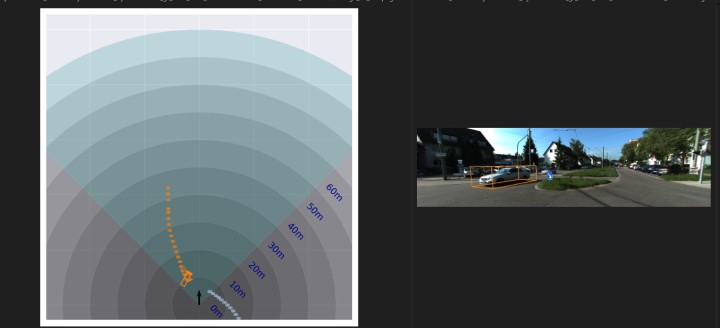

# 3DBBox_plus_BEV_VIS
The scripts can generate 3D BBox tracking / bev / bev trace.
---
1. This script can generate 3D BBox tracking, BEV (Bird's Eye View), and BEV trace. The BEV representations are in the ego-vehicle's camera space.

2. The script follows the KITTI standard. However, for KITTI-360, the rotation matrix C2W is not normalized and requires additional processing. To handle this, an additional `--kitti360` parameter should be added to the command.

3. To run the command:

   ````c#
   python visualize.py -s ${input_data} -m ${trained_model_path} --iteration ${iter} --optical --dynamic --gt_path ${gt_data}
   ```

4. The computation of the pose loss is also included in the `visualize.py - visualize_sets()` section.

<p align="center">
    
</p>
